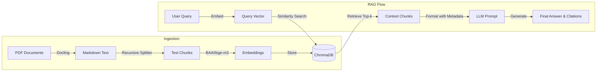

# System Architecture

## Overview
This RAG (Retrieval-Augmented Generation) system is designed to provide accurate, grounded answers to cybersecurity questions using a specific set of PDF documents. The system prioritizes strict adherence to the source material to prevent hallucinations.

## Pipeline Architecture

The system follows a standard RAG pipeline with the following stages:

1.  **Ingestion & Processing**
    *   **Loading**: Documents are loaded from the `dataset/` directory. We use **Docling** for robust parsing of PDF documents into Markdown format, which preserves structure better than plain text extraction.
    *   **Chunking**: The Markdown text is split into smaller chunks using `RecursiveCharacterTextSplitter`. This ensures that semantic context is preserved while keeping chunks within the context window limits of the embedding model.
    *   **Embedding**: Each chunk is converted into a vector embedding using the **BAAI/bge-m3** model (via HuggingFace). This model was chosen for its strong multilingual performance and semantic understanding.
    *   **Storage**: Embeddings are stored in **ChromaDB**, a local vector database, enabling fast similarity search.

2.  **Retrieval**
    *   When a user submits a query, it is converted into an embedding using the same `bge-m3` model.
    *   The system performs a similarity search in ChromaDB to find the top `k` (default 5) most relevant document chunks.

3.  **Generation (The Brain)**
    *   The system uses **LangGraph** to orchestrate the flow.
    *   **Prompting**: A strict system prompt is used to enforce the "dataset-only" rule. It explicitly instructs the LLM to cite sources using `[Source: filename, Page: number]`.
    *   **LLM**: The retrieved context and the user's query are passed to the LLM (OpenAI or Ollama) to generate the final answer.

## System Diagram

## Design Decisions
*   **Docling**: Selected for better handling of complex PDF layouts compared to standard `pypdf`.
*   **LangGraph**: Used instead of a simple chain to allow for future extensibility (e.g., adding a "grading" node to check if documents are relevant before answering).
*   **Separation of Concerns**: The `loader`, `vectorstore`, and `graph` are modularized in the `app/rag` directory for maintainability.
